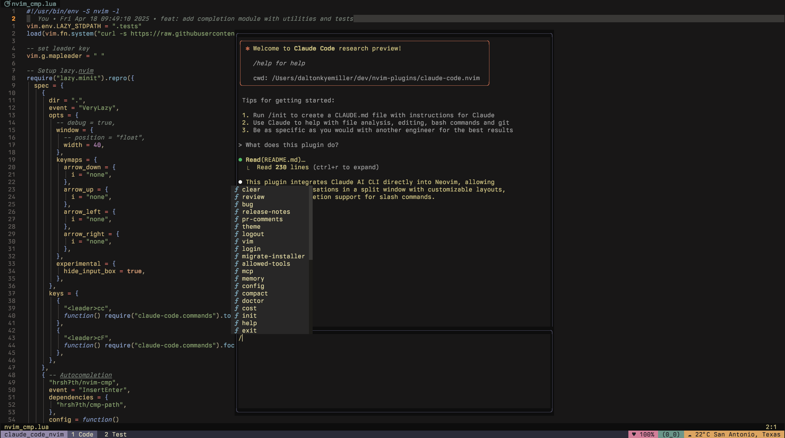

# Claude-Code.nvim

> **⚠️ WORK IN PROGRESS**: This plugin is under active development. APIs and functionality may change significantly

A Neovim plugin that integrates the Claude AI CLI directly into your editor.



## Features

- Interactive Claude AI conversations in a split window
- Multiple window layout options (left, right, floating)
- Customizable window dimensions
- Auto-scrolling for Claude responses
- Custom keyboard shortcuts with separate normal/insert mode mappings
- Window hide/show functionality to temporarily clear Claude from view
- Arrow key navigation when input buffer is empty
- `@` file mentioning to include files in Claude's context
- Experimental feature to hide Claude's input box (using a separate node process and second PTY)
- Completion support for slash commands and templates
  - Integration with nvim-cmp
  - Integration with blink.lua

## Requirements

- Neovim 0.10.0 or later
- Node.js installed on your system
- [Claude CLI](https://docs.anthropic.com/en/docs/agents-and-tools/claude-code/overview) installed and configured

## Installation

<details>
<summary>Using <a href="https://github.com/folke/lazy.nvim">lazy.nvim</a></summary>

```lua
{
  "daltonkyemiller/claude-code.nvim",
  -- NOTE: only required if using experimental.hide_input_box feature
  build = "cd node && npm install",
  config = function()
    require("claude-code").setup({
      -- your configuration here
    })
  end
}
```

</details>

<details>
<summary>Using <a href="https://github.com/wbthomason/packer.nvim">packer.nvim</a></summary>

```lua
use({
  "daltonkyemiller/claude-code.nvim",
  -- NOTE: only required if using experimental.hide_input_box feature
  run = "cd node && npm install",
  config = function()
    require("claude-code").setup({
      -- your configuration here
    })
  end,
})
```

</details>

## Configuration

You can view the default configuration [here](lua/claude-code/config.lua).

<details>
<summary>Full configuration options</summary>

```lua
require("claude-code").setup({
  cmd = "claude", -- Command to invoke Claude CLI
  use_default_mappings = true, -- Set to false to disable automatic key mappings
  debug = false, -- Enable debug logging
  window = {
    position = "float", -- "left", "right", or "float"
    width = 40, -- Width as percentage of screen width
    input_height = 10, -- Height of input window in lines
  },
  keymaps = {
    submit = {
      n = "<CR>",
      i = "<C-s>",
    },
    escape = {
      n = "<Esc>",
      i = "<Esc>",
    },
    switch_window = {
      n = "<Tab>",
      i = "<Tab>",
    },
    close = {
      n = "q",
      i = "q",
    },
    -- Arrow key navigation (only active when input buffer is empty)
    arrow_up = {
      n = "k",
      i = "<C-k>",
    },
    arrow_down = {
      n = "j",
      i = "<C-j>",
    },
    arrow_left = {
      n = "h",
      i = "<C-h>",
    },
    arrow_right = {
      n = "l",
      i = "<C-l>",
    },
  },
  -- Configure slash commands (can set to false to remove a command)
  slash_commands = {
    -- Example: Remove a built-in slash command
    -- ["/clear"] = false,
  },
  -- Configure prompt templates
  prompt_templates = {
    -- Your custom prompt templates
  },
  experimental = {
    hide_input_box = false, -- Hide Claude's input box prompt (uses a separate node process and a second PTY)
  },
})
```

</details>

## Usage

### Commands

The plugin exposes several Lua functions that can be used in your own mappings or commands:

```lua
-- Start Claude
require("claude-code.commands").open()

-- Hide Claude windows (preserves state)
require("claude-code.commands").hide()

-- Show Claude windows (restores from hidden state)
require("claude-code.commands").show()

-- Toggle between hidden and shown states (will start Claude if necessary)
require("claude-code.commands").toggle()

-- Focus the input window
require("claude-code.commands").focus()
```

You can create commands for these functions:

```lua
vim.api.nvim_create_user_command("Claude", function() require("claude-code.commands").open() end, {})
vim.api.nvim_create_user_command("ClaudeHide", function() require("claude-code.commands").hide() end, {})
vim.api.nvim_create_user_command("ClaudeShow", function() require("claude-code.commands").show() end, {})
vim.api.nvim_create_user_command("ClaudeToggle", function() require("claude-code.commands").toggle() end, {})
```

### Default Keybindings

When in the input buffer:

- `<CR>` (Enter) - Send the current buffer content to Claude
- `<C-s>` - Send the current buffer content to Claude (insert mode)
- `<Esc>` - Send escape key to Claude (normal mode)
- `<Tab>` - Switch to Claude buffer (normal mode)
- `q` - Close Claude (normal mode)
- `hjkl` - Navigate the input buffer (normal mode)
- `@` - Mention a file to include in Claude's context (completion available)

When in the Claude buffer:

- `<Tab>` - Switch to input buffer
- `q` - Close Claude

You can customize these keybindings by modifying the `keymaps` table in your configuration.

## Completion Integrations

Claude-Code.nvim provides completion support for slash commands and prompt templates within the Claude input buffer.

<details>
<summary><a href="https://github.com/hrsh7th/nvim-cmp">nvim-cmp</a> integration</summary>

To integrate with [nvim-cmp](https://github.com/hrsh7th/nvim-cmp), add the Claude-Code source to your nvim-cmp configuration:

```lua
local cmp = require("cmp")

cmp.setup({
  sources = {
    { name = "claude-code" },
    -- your other sources
  },
})
```

</details>

<details>
<summary><a href="https://github.com/Saghen/blink.cmp">blink.cmp</a> integration</summary>

For integration with [blink.lua](https://github.com/yorickpeterse/blink.nvim), add the Claude-Code source to your blink.lua sources:

```lua
require("blink").setup({
  sources = {
    default = {
      "claude_code",
      -- your other sources]
    },
    providers = {
      claude_code = {
        module = "claude-code.integrations.completion.blink",
        name = "Claude Code",
        opts = {},
      },
    },
  },
})
```

</details>

## License

MIT

## Contributing

Contributions are welcome! Feel free to open issues or submit pull requests.

